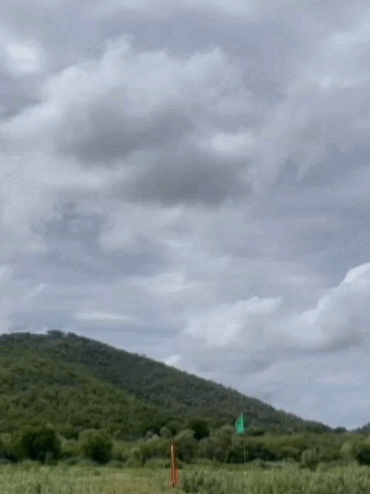
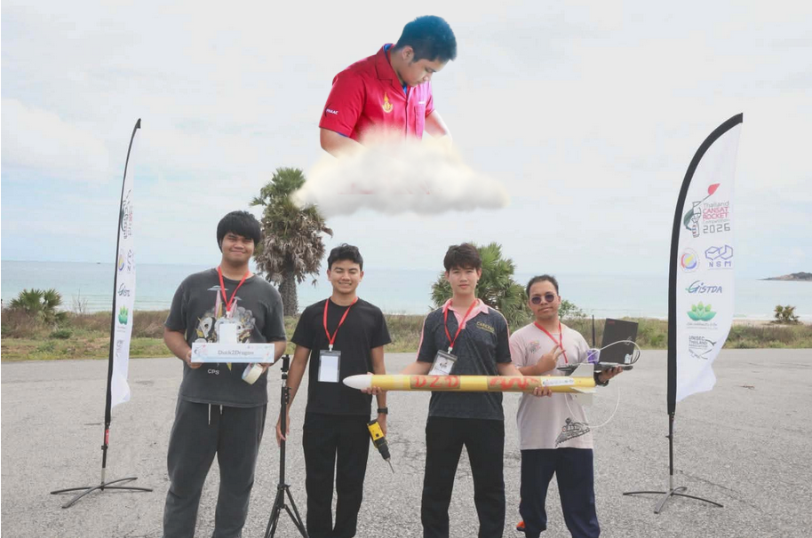
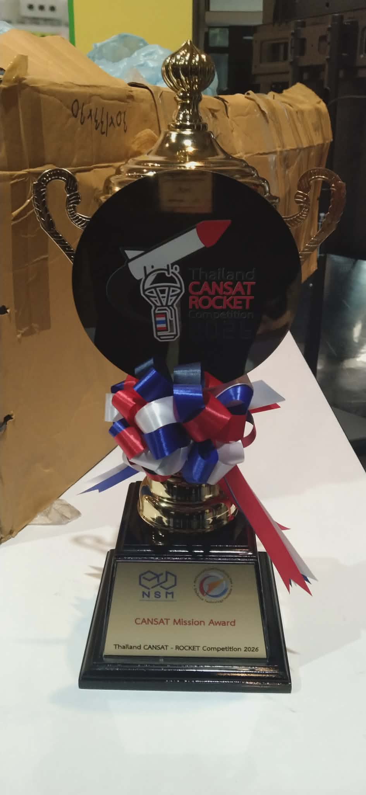
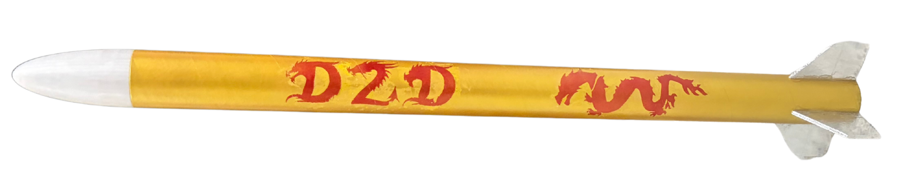
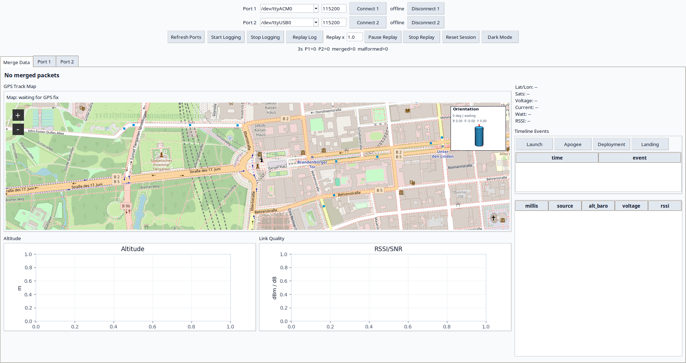

# CANSAT Duck2Dragon

<p align="center">
  <strong>Duck2Dragon CanSat flight computer, LoRa ground station, telemetry monitor, and data analysis workspace.</strong>
</p>

<p align="center">
  
</p>

## **Team**

<p align="center">
  
</p>

1. Chawanakorn Thipjumnong (Electronic)
2. Phattharaphon nualsan (Chemist)
3. Nawapon Kongtantham (Mechanic)
4. Guntinun Sawatwong (Programer)
5. Kanisorn Youynaul (Safety)

## **Trophy**

<p align="center">
  
</p>

<p align="center">
  <strong>CANSAT Mission Award</strong>
</p>

## **Overview**

<p align="center">
  
</p>

<p align="center">
  
</p>

Duck2Dragon is a CanSat and model rocket project. The CanSat rides inside the rocket, records flight data, transmits live telemetry over LoRa, and supports post-flight analysis through Python notebooks and a Tkinter ground station monitor.

The current codebase includes:

- ESP32 CanSat firmware with GPS, BNO08x IMU, ADXL375 high-G acceleration, MS5611 barometer, INA219 power sensing, LoRa telemetry, and LittleFS logging.
- ESP32 LoRa ground station firmware that forwards received telemetry to USB serial.
- Arduino Nano deployment firmware for barometric apogee detection and servo parachute release.
- A Python/Tkinter monitor for two LoRa serial receivers, merged telemetry, replay, live map, charts, logging, and orientation display.
- Jupyter notebooks for telemetry analysis, landing prediction, and gyro/IMU log analysis.
- Test media, reports, presentations, and design/spec documents.


## Repository Layout

```text
CANSAT_Duck2Dragon/
├── assets/                  Project images used by this README and GUI
│   ├── D2D_logo.png
│   ├── Rocket.png
│   └── Reward.png
├── Data/                    Python monitor, notebooks, logs, CSV data
│   ├── ground_station_monitor.py
│   ├── requirements.txt
│   ├── data_analysis.ipynb
│   ├── landing_prediction.ipynb
│   ├── gyro_analysis.ipynb
│   ├── logs/
│   └── *.csv / *.txt telemetry captures
├── Document/                Project document PDF
├── Module_Test/             Standalone Arduino sketches for sensor bring-up
├── Present/                 Pre/post project presentation PDFs
├── Rocket/                  Flight, deployment, and ground station firmware
│   ├── cansat/cansat.ino
│   ├── ground_station/ground_station.ino
│   ├── deployment/deployment.ino
│   ├── gyro/gyro.ino
│   └── cansat_DTI/cansat_DTI.ino
├── Test/                    Test videos and thermal images
├── docs/superpowers/        Design specs and implementation plans
├── libraries/               Arduino libraries vendored with the project
├── LICENSE
└── README.md
```

## Hardware Overview

### CanSat Flight Computer

Target: TTGO SX1276 LoRa32 / ESP32.

| Component | Interface | Current use |
| --- | --- | --- |
| SX1276 LoRa | SPI / VSPI | Sends DTI prefix plus full telemetry CSV |
| NEO-6M / compatible GPS | UART1 | Latitude, longitude, GPS altitude, satellites |
| BNO08x | I2C `0x4A` | Linear acceleration, calibrated gyro, quaternion orientation |
| ADXL375 | I2C `0x54` | High-G acceleration in g |
| MS5611 | I2C `0x77` | Barometric altitude, temperature, pressure |
| INA219 | I2C `0x40` | Bus voltage, current, power |
| LittleFS | ESP32 flash | Local telemetry log at `/cansat.csv` |

Current firmware: `Rocket/cansat/cansat.ino`.

### Ground Station Receiver

Target: TTGO SX1276 LoRa32 / ESP32.

`Rocket/ground_station/ground_station.ino` receives LoRa packets and prints the raw telemetry line to USB serial at `115200` baud. After each packet it also prints a comment line with RSSI and SNR.

### Deployment Subsystem

Target: Arduino Nano.

`Rocket/deployment/deployment.ino` uses an MS5611 barometer to arm after a configured altitude and deploy a servo after confirmed descent near apogee.

Key constants to tune:

- `SERVO_LOCKED_ANGLE`
- `SERVO_DEPLOY_ANGLE`
- `ARM_ALTITUDE_M`
- `APOGEE_CONFIRM_COUNT`
- `APOGEE_DEADBAND_M`

## Pin Summary

### CanSat ESP32

| Function | GPIO |
| --- | --- |
| LoRa SCK | 5 |
| LoRa MISO | 19 |
| LoRa MOSI | 27 |
| LoRa SS | 18 |
| LoRa RST | 14 |
| LoRa DIO0 | 26 |
| I2C SDA | 21 |
| I2C SCL | 22 |
| GPS RX | 3 |
| GPS TX | 1 |

### Ground Station ESP32

| Function | GPIO |
| --- | --- |
| LoRa SCK | 5 |
| LoRa MISO | 19 |
| LoRa MOSI | 27 |
| LoRa SS | 18 |
| LoRa RST | 23 |
| LoRa DIO0 | 26 |

### Deployment Arduino Nano

| Function | Pin |
| --- | --- |
| Servo PWM | D9 |
| I2C SDA | A4 |
| I2C SCL | A5 |
| Status LED | D13 |

## LoRa Settings

The active CanSat and ground station firmware use:

| Setting | Value |
| --- | --- |
| Frequency | `922250000` Hz |
| Bandwidth | `125E3` |
| Spreading factor | `8` |
| Serial baud | `115200` |

Keep the CanSat and ground station settings identical before flight.

## Telemetry Format

The active CanSat firmware builds a 24-field CSV body and logs that body to LittleFS:

```text
lat,lon,alt_gps,sats,millis,alt_baro,temp,pressure,ax,ay,az,gx,gy,gz,qw,qx,qy,qz,high_ax,high_ay,high_az,voltage,current,watt
```

LoRa packets add a 5-field DTI prefix before the CSV body:

```text
team,accel_total,watt,voltage,ampere,<24-field CSV body>
```

The Python monitor strips the prefix when present and stores merged logs with this header:

```text
time,lat,lon,alt_gps,sats,millis,alt_baro,temp,pressure,ax,ay,az,gx,gy,gz,qw,qx,qy,qz,high_ax,high_ay,high_az,voltage,current,watt,source,rssi,snr
```

| Field | Unit | Source |
| --- | --- | --- |
| `lat`, `lon` | degrees | GPS |
| `alt_gps` | m | GPS |
| `sats` | count | GPS |
| `millis` | ms | ESP32 runtime |
| `alt_baro` | m | MS5611 |
| `temp` | C | MS5611 |
| `pressure` | hPa | MS5611, with firmware compensation |
| `ax`, `ay`, `az` | m/s^2 | BNO08x linear acceleration |
| `gx`, `gy`, `gz` | rad/s from BNO08x report | BNO08x calibrated gyro |
| `qw`, `qx`, `qy`, `qz` | unit quaternion | BNO08x rotation vector |
| `high_ax`, `high_ay`, `high_az` | g | ADXL375 |
| `voltage` | V | INA219 |
| `current` | mA | INA219 |
| `watt` | W | Calculated from INA219 |

Lines beginning with `#` are metadata or receiver status lines. Analysis tools should keep them for debugging or skip them when loading numeric rows.

## Arduino Setup

Install ESP32 board support in Arduino IDE, then install or use the libraries in `libraries/`.

Main libraries used by the current sketches:

| Library | Used by |
| --- | --- |
| LoRa | CanSat and ground station LoRa |
| TinyGPSPlus | GPS parsing |
| Adafruit BNO08x | IMU orientation, acceleration, gyro |
| Adafruit ADXL375 | High-G accelerometer |
| Adafruit INA219 | Power telemetry |
| MS5611 | Barometer |
| ESP32 LittleFS support | CanSat local logging |
| Servo | Arduino Nano deployment |

For `Rocket/cansat/cansat.ino`, use an ESP32 partition scheme with LittleFS/SPIFFS space, such as `Default 4MB with spiffs`.

## Upload Firmware

### CanSat

1. Open `Rocket/cansat/cansat.ino`.
2. Select the TTGO LoRa32 / compatible ESP32 board.
3. Select a partition scheme with SPIFFS/LittleFS space.
4. Upload.
5. Confirm sensor wiring before flight. The firmware retries failed sensors during runtime.

### Ground Station

1. Open `Rocket/ground_station/ground_station.ino`.
2. Select the TTGO LoRa32 / compatible ESP32 board.
3. Upload.
4. Open Serial Monitor at `115200`.
5. Confirm it prints `# Ground Station ready`.

### Deployment

1. Open `Rocket/deployment/deployment.ino`.
2. Select Arduino Nano / ATmega328P.
3. Upload.
4. Open Serial Monitor at `9600`.
5. Verify the servo lock/deploy angles on the real mechanism before installing it in the rocket.

## Python Environment

Create and install the analysis/monitor dependencies:

```bash
python3 -m venv .venv
source .venv/bin/activate
python3 -m pip install -r Data/requirements.txt
python3 -m pip install tkintermapview
```

`tkinter` is usually provided by the system package manager, not pip. On Debian/Ubuntu:

```bash
sudo apt install python3-tk
```

## Ground Station Monitor

Run the GUI:

```bash
python3 Data/ground_station_monitor.py
```

The monitor is titled **Duck2Dragon Monitor** and uses `assets/D2D_logo.png` as the application icon.

Main features:

- Reads two serial receivers at the same time.
- Merges packets from `Port 1` and `Port 2`.
- Keeps the strongest duplicate packet by RSSI where applicable.
- Saves raw, merged, and event logs under `Data/logs/`.
- Replays existing `.txt` or `.csv` telemetry logs.
- Shows tabs for merged data, port 1, and port 2.
- Displays altitude, RSSI/SNR, sensor charts, and GPS data.
- Uses `tkintermapview` for a draggable OpenStreetMap GPS view when installed.
- Falls back to Matplotlib GPS plotting when the interactive map dependency is unavailable.
- Shows a 3D CanSat orientation overlay from BNO quaternion data.
- Supports light/dark theme switching.

Useful helper:

```bash
python3 Data/scan_ports.py
```

## Serial Loggers

Legacy command-line serial loggers are also available:

```bash
python3 Data/read_serial_1.py /dev/ttyACM0 115200
python3 Data/read_serial_2.py /dev/ttyUSB0 115200
```

They append to:

- `Data/log_1.txt`
- `Data/log_2.txt`

Prefer `Data/ground_station_monitor.py` for current dual-LoRa operation because it understands prefix stripping, merged logs, replay, charts, and map display.

## Data and Notebooks

Important analysis files:

| File | Purpose |
| --- | --- |
| `Data/data_analysis.ipynb` | General post-flight telemetry analysis |
| `Data/landing_prediction.ipynb` | Landing prediction and recovery-zone simulation |
| `Data/gyro_analysis.ipynb` | Analysis for `Data/gyro_log.csv` |
| `Data/Prediction.pdf` | Research/reference material for prediction work |
| `Data/rocket_design.ork` | OpenRocket design file |

Run notebooks from the repository root:

```bash
jupyter notebook Data/data_analysis.ipynb
jupyter notebook Data/landing_prediction.ipynb
jupyter notebook Data/gyro_analysis.ipynb
```

Example logs and processed outputs are stored in `Data/` and `Data/logs/`. Some files are real captured data and some are test/replay inputs, so check the header and field order before using a file for final analysis.

## Module Tests

`Module_Test/` contains standalone sketches for individual parts:

| Sketch | Purpose |
| --- | --- |
| `adxl375/adxl375.ino` | High-G accelerometer test |
| `bno055/bno055.ino` | BNO055 test sketch |
| `gps/gps.ino` | GPS readout |
| `ina219/ina219.ino` | Voltage/current sensor |
| `lora/lora.ino` | LoRa send/receive test |
| `ms5611/ms5611.ino` | Barometer test |
| `ms5611_diag/ms5611_diag.ino` | Barometer diagnostics |
| `sd_card/sd_card.ino` | SD card test |
| `servo/servo.ino` | Servo movement test |
| `i2c_scanner/i2c_scanner.ino` | I2C address scan |
| `camera/camera.ino` | Camera module test |
| `sent_data/sent_data.ino` | Transmit test |
| `recive_data/recive_data.ino` | Receive test |

Use these before full-system integration when a sensor or link behaves unexpectedly.

## Documents, Presentations, and Test Media

Project references:

- `Document/Duck2Dragon.pdf`
- `Present/Pre-Duck2Dragon.pdf`
- `Present/Post-Duck2Dragon.pdf`
- `docs/superpowers/specs/`
- `docs/superpowers/plans/`

Test evidence:

- `Test/shock_test.mp4`
- `Test/eject_test_01.mp4`
- `Test/eject_test_02.mp4`
- `Test/parachute_rocket_test.mp4`
- `Test/parachute_cansat_test.MOV`
- `Test/thermal_test_01.jpeg`
- `Test/thermal_test_02.jpeg`
- Other subsystem test videos in `Test/`

## Flight Workflow

1. Run module tests for sensors, LoRa, deployment servo, and power.
2. Upload `Rocket/cansat/cansat.ino` to the CanSat ESP32.
3. Upload `Rocket/ground_station/ground_station.ino` to one or two receiver ESP32 boards.
4. Upload and bench-test `Rocket/deployment/deployment.ino`.
5. Start the Python monitor.
6. Confirm live packets, RSSI/SNR, GPS fix, barometer, IMU quaternion, and power values.
7. Save a short pre-flight replayable log.
8. Launch and keep the monitor logging until recovery.
9. Analyze saved logs with the notebooks in `Data/`.

## Safety Notes

- Connect the LoRa antenna before powering any transmitter.
- Verify the deployment servo direction and lock angle without pyrotechnic or spring load first.
- Keep the deployment subsystem independently testable.
- Confirm battery voltage and current readings before flight.
- Confirm GPS fix and satellite count outdoors before launch.
- Treat malformed telemetry as expected during startup; the monitor is designed to keep logging even when some rows are incomplete.

## License

MIT. See `LICENSE`.
